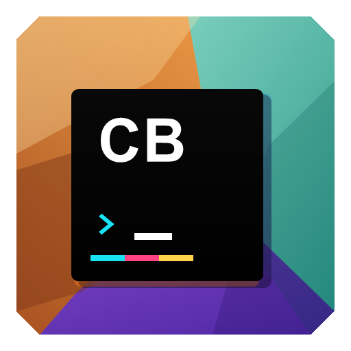

<p align="center">
  
</p>

<h1 align="center">Command Block Studio</h1>

<p align="center">
  <em>A NeoForge-native command block development workspace for multiple Minecraft versions</em>
</p>

<p align="center">
  
  
  
  
  
  
</p>

---

## 简介

**Command Block Studio** 是面向 Minecraft `1.20.4`、`1.21.1`、`1.21.4` 与 `26.2` 的 NeoForge 原生命令方块开发工作台。

它会替换原版命令方块编辑界面，把单行输入框升级为接近代码编辑器的命令工作台，并提供多行可视排版、Brigadier 补全、快速文档、参数填入、问题诊断、输出面板和区域选择辅助。客户端与服务端可以完全独立安装：客户端单独安装即可使用编辑器，服务端单独安装也不会阻止原版客户端连接；双端都安装时会额外启用共享注释、版本化编辑记录和增强的工作区同步。

本仓库基于官方 NeoForge MDK 模板创建，各版本保留对应年代的 NeoGradle 或 ModDevGradle、资源模板和运行配置结构；运行层使用 NeoForge 原生实现，不依赖 Fabric API 或兼容层。

完整使用与开发文档由默认分支统一维护，入口为 [`docs/`](https://github.com/M1oFeather/CommandBlockStudio/tree/1.21.1/docs)，版本选择、更新日志与三平台发布资料归档在 [`docs/releases/`](https://github.com/M1oFeather/CommandBlockStudio/tree/1.21.1/docs/releases)。仓库内的 GitHub Actions 会在默认分支文档更新后自动同步到 GitHub Pages，Pull Request 则执行严格构建校验。

---

## 支持版本

| Minecraft | NeoForge | Git 分支 | 构建文件 |
| --- | --- | --- | --- |
| `1.20.4` | `20.4.167` | `1.20.4` | `command_block_studio-<模组版本>-1.20.4-NeoForge.jar` |
| `1.21.1` | `21.1.217` | `1.21.1`（默认分支） | `command_block_studio-<模组版本>-1.21.1-NeoForge.jar` |
| `1.21.4` | `21.4.121` | `1.21.4` | `command_block_studio-<模组版本>-1.21.4-NeoForge.jar` |
| `26.2` | `26.2.0.10-beta` | `26.2` | `command_block_studio-<模组版本>-26.2-NeoForge.jar` |

`1.20.4` 使用 Java 17，`1.21.1`、`1.21.4` 与 `26.2` 使用 Java 21。下载时请让文件名中的 Minecraft 版本与游戏实例完全一致；详细选择方法见默认分支的[版本选择](https://github.com/M1oFeather/CommandBlockStudio/blob/1.21.1/docs/releases/versions.md)。

---

## 核心特性

### Studio 工作台

- **顶部上下文栏**：集中放置命令方块类型、条件模式、红石模式、输出追踪、目标坐标与设置入口。
- **左侧活动栏**：在编辑器、快速文档、问题、输出、命令工具和可选的共享注释之间切换。
- **工作区页签**：编辑区上方按“当前方块、连锁方块、固定方块”组织页签；每个页签都有独立图钉，滚轮可横向浏览溢出的页签但不会自动切换编辑目标。
- **中央编辑器**：使用稳定的 `command.mcfunction` 编辑标签、字符计数、行号、光标状态和保存状态；当前行以黄色标记，错误行以红色标记。
- **右侧快速文档**：持续显示当前命令、参数、补全候选或语法问题的说明与示例，避免悬浮窗遮挡光标附近文本。
- **底部工具窗口**：问题与上次输出使用可开合面板，未完成参数显示为警告而不是错误。
- **可控保存策略**：底部只保留“保存”和“取消”；保存会提交并关闭，`Ctrl+S` 可只保存而保持编辑器打开。自动保存默认开启，Enter 不保存也不关闭界面。

### 命令编辑器

- **多行命令输入**：替代原版单行输入框，长命令可以直接在界面中阅读和编辑。
- **水平/垂直滚动**：保留对超长命令和大块文本的导航能力。
- **搜索与替换**：命令工具 Dock 提供查找、上一个/下一个、区分大小写、单次替换和全部替换；支持 `Ctrl+F`、`Ctrl+H`、`F3` 与 `Shift+F3`。
- **括号缩进与格式化**：支持基于括号、逗号和字符串状态的自动排版。
- **命令输出面板**：编辑器保持可见，上一次输出在底部工具窗口中独立查看。

### 命令智能提示

- **聊天命令助手**：聊天框内容以 `/` 开头时，右侧自动展开约四分之一屏幕宽的命令助手；它复用 Studio 的参数文档、增强补全、粒子/方块/物品预览和玩家头像信息，普通聊天时完全隐藏。
- **悬停解释**：鼠标停在命令或参数上时，显示当前命令节点的说明与示例。
- **当前参数提示**：光标所在参数会在编辑器底部显示简短解释，接近代码编辑器的 signature help。
- **原生自动补全**：补全候选来自当前连接的 Brigadier 命令树，并在光标后显示灰色幽灵文本；悬停候选项可查看对应命令或参数说明。
- **文本 Component 补全**：在 `tellraw`、`title` 等富文本参数中继续解析未闭合 JSON，补全 `text`、`translate`、`score`、`selector`、`nbt`、样式字段以及 `clickEvent` / `hoverEvent` 的嵌套结构；快速文档会跟随当前字段和选中候选。
- **物品数据组件补全**：`give` 等物品参数的组件键直接取自当前游戏版本的 `DATA_COMPONENT_TYPE` 注册表，并为常用组件提供值模板与说明；`custom_name`、`item_name`、`lore` 中嵌套的文本 Component 也会继续补全。
- **语义化候选**：方块候选显示实际方块图标、方块名称和状态属性；附魔候选显示本地化名称与等级范围；玩家候选优先排列 Tab 在线玩家并显示皮肤头像，其他玩家名使用稳定的原版默认头像。
- **编辑器式补全**：`Ctrl+Space` 随时打开补全列表，`Enter` 或 `Tab` 接受当前候选，方向键切换候选。
- **清晰反馈**：参数状态栏会完整换行显示，保存成功消息以标题和命令预览分行呈现。
- **复合参数占位**：三维/二维坐标、方块坐标和旋转参数尚未写完时，以半透明文字显示缺少的部分；例如 `tp @p 2 71` 会提示 `<z>`，不会提前标成语法错误。
- **模板填充**：当输入停在命令名本身时，可按 `Ctrl+Shift+Space` 插入命令模板，并自动选中第一个 `<placeholder>`。
- **占位符填入与跳转**：复合参数未完成时，`Tab` 可写入并选中缺失占位符；模板插入后，`Tab` / `Shift+Tab` 可在 `<placeholder>` 之间前后移动。
- **实时语法诊断**：无法解析的命令片段使用红色高亮，状态栏显示精确行列，并提供紧凑的跳转按钮；悬停说明只保留有效错误内容。
- **粒子预览与译名**：粒子候选和快速文档显示粒子纹理预览、本地化中文名、注册 ID 与可用示例，长文档可独立滚动。
- **编辑历史**：支持 `Ctrl+Z` 撤销、`Ctrl+Y` 或 `Ctrl+Shift+Z` 重做，并按连续输入合并历史记录。
- **成对符号编辑**：自动闭合 `{}`、`[]`、`()`、单双引号，支持包裹选区、跳过已有闭合符号和成对退格。
- **括号配对定位**：光标位于结构括号两侧时同步标出配对括号；不匹配的结构括号使用错误色提示，并忽略字符串中的符号。
- **代码编辑器式导航**：`Home` / `End` 移动到当前可视行首尾，`Ctrl+Home` / `Ctrl+End` 移动到整条命令首尾。
- **Brigadier 语义定位**：基于服务器下发的原生命令树解析当前位置，兼容 vanilla 与可解析的服务端命令结构。
- **完整根命令文档**：内置原版、专用服务器、别名及开发命令的中英文说明和模板；子命令、参数名和 Brigadier 参数类型使用三层回退说明。
- **模组命令软兼容**：为 WorldEdit、NeoForge Carpet、Create、CMDCam、Corpse、Dynamic Trees、Exposure、Serene Seasons、Supplementaries、WaterFrames、SecurityCraft 和 Yes Steve Model 的已确认命令根提供说明；未内置的服务端命令仍会根据当前命令树生成签名、参数类型说明和最短可执行模板。
- **注册表预览回退**：模组命令使用自定义参数类型时，只要参数名和候选能识别为方块、物品、粒子或玩家，候选列表仍会显示对应图标、粒子纹理或头像。

### 命令方块控制

- **图标化按钮**：压缩命令方块类型、条件、红石、输出等控制按钮，让主要空间留给命令文本。
- **命令方块矿车支持**：矿车命令方块同样打开增强后的编辑界面。
- **即时方块控制**：命令方块类型、条件模式和红石模式点击后立即同步；命令文本按自动保存或手动保存策略提交。
- **共享方块注释**：服务端同时安装模组时，注释入口紧跟在左侧活动栏的工具入口后；有权限的编辑者可说明命令方块用途，内容随方块持久化并由服务端同步。
- **版本化编辑记录**：服务端为每个命令方块保留最近 10 个完整版本，包括命令、方块模式、条件、红石需求和输出追踪；注释页可选择旧版本回滚，当前版本仍会作为历史保留。
- **背包命令摘要**：带方块实体数据的命令方块物品会在悬停提示中显示命令开头；若物品同时携带 Studio 编辑历史，还会显示最后编辑时间和编辑者。
- **工作模式投影**：默认按 `Alt+Tab` 切换工作模式，准星指向命令方块时会在该方块前方悬浮显示命令、模式、坐标与最后编辑信息；投影始终朝向玩家。快捷键可在“控制 -> 按键绑定 -> Command Block Studio”中修改；若操作系统拦截 `Alt+Tab`，请改绑为其他组合键。
- **运行测试**：编辑器底部的播放按钮会先保存当前修改，再让服务端触发一次命令方块，无需临时放置红石块。
- **逐功能兼容**：客户端与服务端版本号允许不同；注释、预览、运行测试等功能分别检查载荷通道，不支持的入口会隐藏或禁用。

### 区域选择辅助

- **快捷键选点**：默认使用 `;` 记录区域角点。
- **剪贴板输出**：选择两个角点后，自动生成可粘贴到命令中的区域选择参数。

### 配置界面

- **NeoForge 原生配置入口**：通过 NeoForge 的配置界面扩展注册。
- **原生客户端配置**：使用 `ModConfigSpec` 注册并保存到 `config/command_block_studio-client.toml`，不使用自定义配置兼容层。
- **独立界面缩放**：支持自动、70%、80%、90%、100%、110% 和 125%；自动模式根据玩家当前 GUI 比例选择，并以不直接链接 Modern UI API 的方式进行软兼容。

---

## 项目结构

```text
src/main/java/com/miofeather/commandblockstudio/
|-- main/
|   |-- CommandBlockStudio.java          # NeoForge 客户端入口、事件注册、配置读写
|   |-- CommandBlockStudioMod.java       # 公共入口与可选服务端网络注册
|   |-- network/                          # 共享命令方块注释载荷与持久化
|   |-- AreaSelectionHandler.java          # 区域选择与剪贴板生成
|   |-- ChainHandler.java                  # 命令方块链辅助逻辑
|   |-- config/                            # 原生 ModConfigSpec 与配置界面
|   |-- insight/                           # 命令文档、参数说明与语法诊断
|   `-- ui/                                # 命令方块编辑器 UI 组件
|       |-- screen/                        # 命令方块/矿车命令方块屏幕
|       |-- MultiLineTextFieldWidget.java  # 多行命令编辑框
|       |-- MultiLineCommandSuggestor.java # 多行命令补全
|       `-- ScrollbarWidget.java           # 滚动条组件
`-- mixin/
    |-- CommandBlockMixin.java             # 替换命令方块打开界面
    |-- CommandBlockMinecartMixin.java     # 替换矿车命令方块打开界面
    |-- ClientPacketListenerMixin.java     # 同步命令方块更新到当前界面
    `-- *Accessor.java                     # 访问原版私有状态的客户端 Accessor

src/main/resources/
|-- META-INF/neoforge.mods.toml            # 由模板展开生成的 NeoForge 元数据
|-- command_block_studio.mixins.json       # Mixin 配置
`-- assets/command_block_studio/           # 语言、图标、GUI 纹理与 atlas
```

---

## 使用指南

### 打开界面

1. 要使用 Studio 界面时，将与当前 Minecraft 版本匹配的 NeoForge 构建安装到客户端；服务端是否安装不影响客户端连接。
2. 进入拥有命令方块编辑权限的世界或服务器。
3. 打开命令方块或命令方块矿车，界面会自动替换为增强版编辑器。

### 区域选择

```text
第一次按下快捷键 -> 记录第一个角点
第二次按下快捷键 -> 记录第二个角点，并把区域选择参数写入剪贴板
```

生成内容可直接粘贴进命令中，用于 `x`、`y`、`z`、`dx`、`dy`、`dz` 等区域选择参数。

### 模板填充

```text
输入 /execute -> 按 Ctrl+Shift+Space -> 插入 execute as <targets> at @s run <command>
输入 /fill    -> 按 Ctrl+Shift+Space -> 插入 fill <from> <to> <block> replace
```

模板插入后会自动选中第一个 `<placeholder>`，可以直接输入参数覆盖它；之后使用 `Tab` / `Shift+Tab` 在剩余占位符之间移动。

坐标类参数会同时显示可接受的绝对坐标、相对坐标和局部坐标形式。例如输入 `tp @p 2 71` 时，编辑器显示半透明的 `<z>`；按 `Tab` 会填入并选中该占位符，按 `Ctrl+Space` 则查看当前命令源提供的实际坐标补全。

### 编辑器键位

| 键位 | 功能 |
| --- | --- |
| `Ctrl+Space` | 主动打开当前位置的命令补全 |
| `Enter` / `Tab` | 接受当前补全候选；候选关闭时 `Enter` 不提交或关闭界面，`Tab` 填入缺失参数或跳转模板占位符 |
| `Ctrl+Shift+Space` | 插入当前根命令的模板 |
| `Ctrl+F` / `Ctrl+H` | 打开命令工具的查找 / 替换输入框 |
| `F3` / `Shift+F3` | 跳到下一个 / 上一个匹配项 |
| `Ctrl+S` | 保存当前修改但保持工作台打开 |
| `Ctrl+Z` | 撤销 |
| `Ctrl+Y` / `Ctrl+Shift+Z` | 重做 |
| `↑` / `↓` | 在补全候选之间移动 |
| `Home` / `End` | 移动到当前可视行的行首 / 行尾 |
| `Ctrl+Home` / `Ctrl+End` | 移动到整条命令的开头 / 末尾 |
| `Esc` | 关闭补全列表 |

### 命令提示语言

命令方块编辑界面的顶部应用栏提供 **设置** 按钮。进入设置页后点击 **命令提示语言...**，可在子页面中选择中文或 English。该设置会影响快速文档、参数提示、补全说明和模板说明。

左侧活动栏使用统一图标区分快速文档、问题、命令输出、命令工具和共享注释。工具入口内含“查找替换”和“转换器”两个页签；后者提供角度/弧度与 RGB/十六进制颜色换算，所有工具都只作用于当前编辑器，不修改模组配置。活动栏、图钉与页签翻页按钮直接使用 Game Icon Pack 的矢量图形导出，并启用平滑纹理过滤，避免低分辨率像素字体图标显得粗重。

活动栏、页签图钉和页签翻页图标取自 [M1oFeather/Game-Icon-Pack](https://github.com/M1oFeather/Game-Icon-Pack)，按 CC0-1.0 许可随项目分发。

---

## 配置

配置文件位于：

```text
config/command_block_studio-client.toml
```

常用配置包括：

| 配置项 | 说明 |
| --- | --- |
| `indentation_spaces` | 自动缩进宽度 |
| `wraparound` | 命令文本自动换行宽度 |
| `scroll_step_horizontal` / `scroll_step_vertical` | 横向/纵向滚动速度 |
| `autosave` | 输入时自动保存命令，默认开启 |
| `confirm_unsaved_exit` | 关闭自动保存后，Esc 退出时是否提示未保存修改 |
| `format_strings` | 格式化时是否处理字符串内容 |
| `bracket_autocomplete` | 是否自动闭合括号与引号 |
| `command_insight_language` | 命令智能提示语言，支持 `zh_cn` / `en_us` |
| `ui_scale_percent` | Studio 独立界面比例，支持 70%-125% 实时滑动；`0` 为根据 Minecraft GUI 画布自动选择 |

---

## 开发指南

### 构建环境

```powershell
# JDK 21
# Gradle Wrapper 已包含在仓库中

.\gradlew.bat --no-configuration-cache --console plain build
.\gradlew.bat --no-configuration-cache --console plain test
.\gradlew.bat --no-configuration-cache --console plain runClient
```

IDE 的 `Client` 配置会读取 ModDevGradle 生成的 `build/moddev/clientRunVmArgs.txt`。项目同步和 `build` 都会自动刷新该文件；若手动删除了整个 `build` 目录，可单独执行：

```powershell
.\gradlew.bat --no-configuration-cache --console plain prepareClientRun
```

构建产物输出到：

```text
build/libs/command_block_studio-1.1.0-<Minecraft版本>-NeoForge.jar
```

### 文档站

文档使用 Material for MkDocs。首次本地预览：

```powershell
python -m venv .venv-docs
.\.venv-docs\Scripts\python.exe -m pip install -r requirements-docs.txt
.\.venv-docs\Scripts\python.exe -m mkdocs serve
```

提交前可运行严格构建：

```powershell
.\.venv-docs\Scripts\python.exe -m mkdocs build --strict
```

GitHub Pages 工作流位于 [`.github/workflows/docs.yml`](.github/workflows/docs.yml)。首次部署前，需要在仓库 [**Settings → Pages**](https://github.com/M1oFeather/CommandBlockStudio/settings/pages) 中将发布源设置为 **GitHub Actions**；这个一次性仓库设置不能由默认的 `GITHUB_TOKEN` 自动创建。未启用时工作流会完成文档构建并给出 warning，启用后重新运行工作流或再次推送文档修改即可发布。

### 命名信息

| 项目 | 值 |
| --- | --- |
| Mod ID | `command_block_studio` |
| Java package | `com.miofeather.commandblockstudio` |
| Resource namespace | `command_block_studio` |
| Mixin config | `command_block_studio.mixins.json` |

---

## 技术亮点

- **NeoForge 原生生命周期**：使用 `@Mod`、NeoForge 事件总线、`RegisterKeyMappingsEvent` 和 `IConfigScreenFactory`。
- **官方 MDK 模板保留**：沿用 NeoForge MDK 的 `gradle.properties`、模板资源展开和 ModDevGradle 构建流程。
- **客户端/服务端分层加载**：公共入口和可选注释网络可在 dedicated server 加载，所有编辑器、渲染与配置界面类仍只在物理客户端初始化。
- **原生可选网络**：共享注释使用 NeoForge `RegisterPayloadHandlersEvent` 与可选载荷协商；客户端和服务端任意一侧缺少模组都不会因此断开连接，客户端会在通道不可用时隐藏服务端专属入口。
- **最小化 Mixin 面**：Mixin 仅保留用于替换原版命令方块界面和访问必要私有状态的部分。
- **命令语义服务**：在原版 `CommandSuggestions` 之上增加 hover insight 与 cursor insight，不改写命令提交路径。
- **无兼容层依赖**：不依赖 Fabric API、Architectury 或其他跨加载器桥接层。

---

## 项目信息

<table>
  <tr>
    <td align="center"><b>作者与维护者</b></td>
    <td>MioFeather</td>
  </tr>
  <tr>
    <td align="center"><b>原生平台</b></td>
    <td>Minecraft 1.20.4 / 1.21.1 / 1.21.4 / 26.2 · NeoForge</td>
  </tr>
  <tr>
    <td align="center"><b>许可证</b></td>
    <td><a href="LICENSE">MIT</a></td>
  </tr>
</table>
